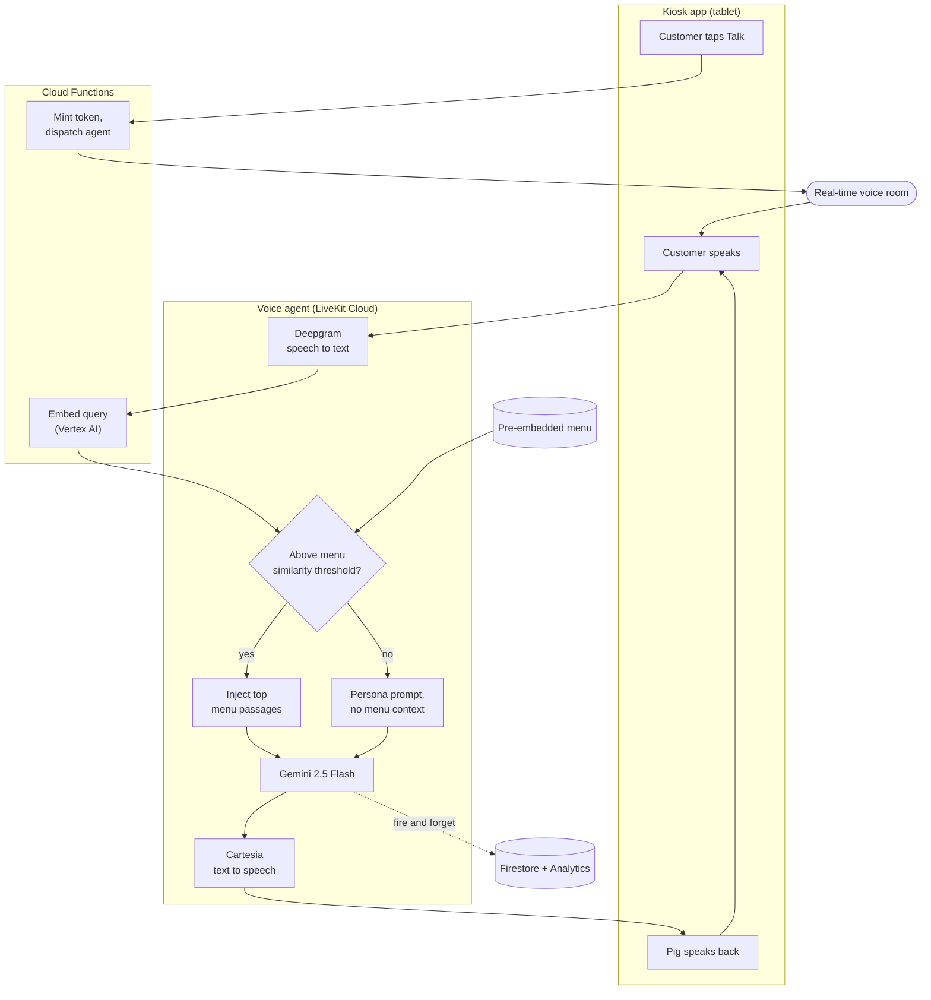

# Ooink AI

An animated AI pig that answers customer questions about the Ooink Ramen menu by voice,
running on a tablet outside the restaurant. Customers waiting in line tap Talk and have a
real-time spoken conversation. The Pig explains dishes, recommends items, and handles small
talk in character, turning wait time into a reason to come inside.

## What it is

A voice-only kiosk experience. Speech recognition, the language model, text-to-speech, and
menu retrieval all run server-side, so the tablet is a thin client that streams audio and
renders the conversation. Everything runs under one Firebase project.

## How it works

Step by step:

1. A customer taps Talk. The app requests a short-lived access token, connects to a real-time
   voice room, and the Pig agent joins.
2. The customer speaks; their audio is transcribed to text in real time.
3. Each turn, the query is embedded and compared against the pre-embedded menu by cosine
   similarity.
4. If the best matches clear a relevance threshold, the relevant menu passages are injected
   into the prompt and the Pig answers grounded in the menu. If nothing clears it, the Pig
   answers in persona (greetings, jokes, small talk) with no menu context.
5. The reply is spoken back with low-latency text-to-speech, and the turn repeats.

Truly off-topic questions (math, politics, coding, other restaurants) are deflected in
character. After a few minutes of silence the Pig says goodbye and the session ends, returning
the tablet to its idle state.

## Architecture

Three deployable pieces, one Firebase project.

- **Kiosk app**: the tablet UI. Voice-only, MVVM with Provider as the single state-management
  layer. It connects to the voice room, renders the agent's state and live transcripts, and
  logs conversations and usage events. It runs no speech, model, or retrieval on-device.

- **Voice agent**: a real-time pipeline deployed to LiveKit Cloud, chaining Deepgram (speech
  to text), Gemini 2.5 Flash (language model), and Cartesia (text to speech). It owns the
  per-turn menu retrieval and the routing that decides whether the Pig answers from the menu
  or in persona.

- **Cloud Functions**: two serverless endpoints. One mints the kiosk's voice-room token and
  dispatches the Pig agent into a fresh room; the other generates text embeddings (Vertex AI)
  for the retrieval step.

Conversation logs and feedback are written to Firestore, and usage events to Firebase
Analytics. Both are fire-and-forget, so neither ever blocks the conversation.

### Retrieval

The menu is chunked and embedded ahead of time. Each user turn is embedded live and scored
against those chunks by cosine similarity; the top matches above the threshold become the
grounding context for that turn. This keeps the Pig's menu answers accurate without scripting
responses, while leaving it free to stay conversational for everything else.
